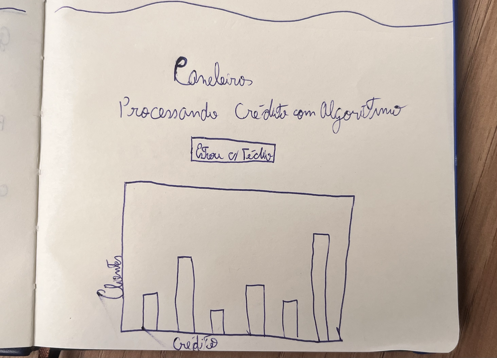
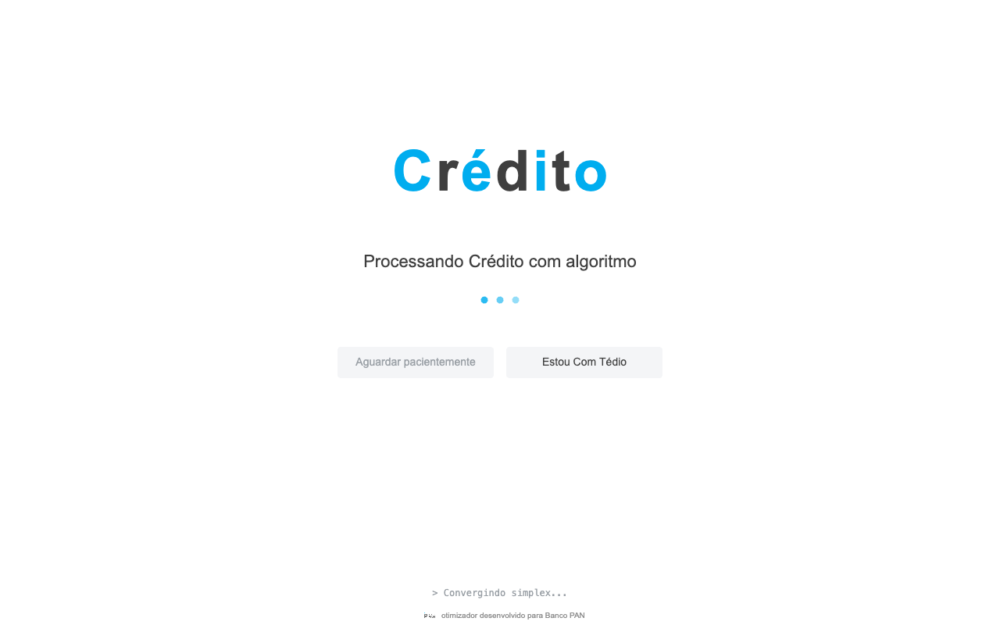
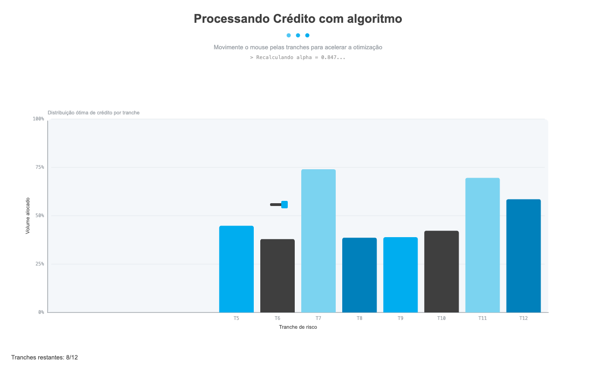
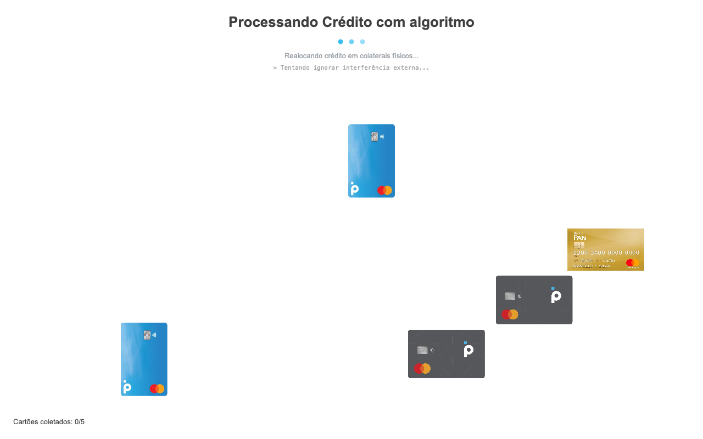
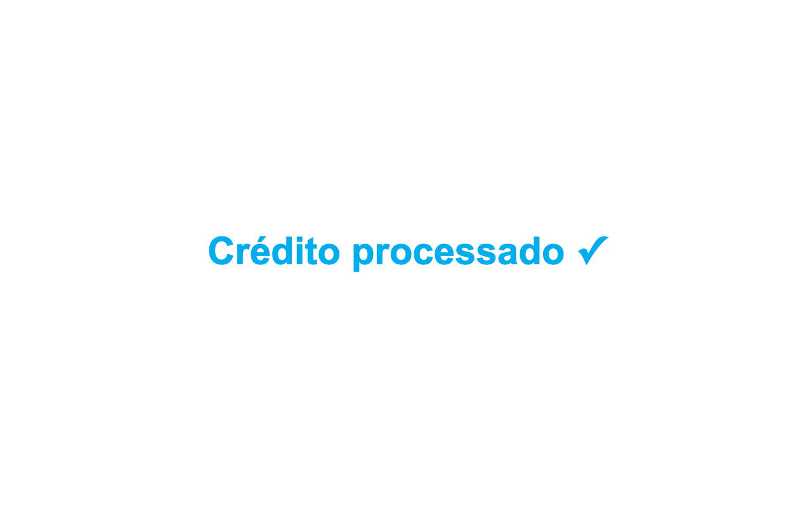

# Fun Loading Screen

Tela de loading interativa em p5.js. Brincadeira pra matar os 15 segundos que o algoritmo de otimização de crédito leva pra rodar.

## 1. Introdução à proposta

O projeto principal da T15 (Inteli, 2026-1B) é um otimizador combinatório de crédito para o Banco PAN. O algoritmo roda em uns 15 segundos. 15 segundos é pouco tempo pra ler um livro e muito tempo pra ficar olhando spinner.

Essa tela troca o spinner por uma referência direta ao "Estou Com Sorte" do Google. O usuário vê "Processando Crédito com algoritmo" e dois botões: um cinza desabilitado ("Aguardar pacientemente") e o "Estou Com Tédio". Quem clica no segundo cai num minigame de duas fases:

1. Passar o mouse nas barras de um gráfico fake de alocação de crédito; cada barra que o cursor toca sai voando pra fora do gráfico.
2. Clicar nos 5 cartões PAN que flutuam pela tela.

Quem termina antes do timer (invisível) chegar a 15s ganha "Você matou seu tédio!". Quem não termina vê "Crédito processado ✓" e o loop reinicia.

## 2. Rascunhos iniciais



Esse foi o esboço inicial num caderno. A ideia já tinha o título, o botão "Estou C/ Tédio" e o gráfico de barras com eixos Cliente × Crédito. A fase dos cartões veio depois, durante a definição da mecânica com a equipe. A ideia era ter uma mudança brusca de gameplay no meio do minigame.

## 3. Como a ideia funciona e fluxo de uso

### Estados

```
[loading]
   |
   +-- clique em "Estou Com Tédio" --> [bars]
                                         |
                                         +-- todas as 12 tranches removidas --> [cards]
                                         |                                        |
                                         |                                        +-- 5 cartões clicados --> [win]
                                         |
                                         +-- timer (15s) expirou --> [done] --5s--> [loading]
```

### Telas



Tela inicial. Logo "Crédito" alternando o cyan e o cinza escuro do Banco PAN, dois botões e log fake rotativo no rodapé.



Fase 1. Cursor vira um taquinho. Passar o mouse por cima de uma barra a manda pra fora do gráfico, com rotação e gravidade. Tirar todas as 12 libera a próxima fase.



Fase 2. Cinco cartões PAN (2 azul, 2 cinza, 1 gold) flutuam pela tela tipo screensaver DVD. Clicar coleta.


Vitória. Mensagem aparece e o timer ganha 3 segundos extras pra dar tempo de ler.



Fim. "Crédito processado ✓" em PAN cyan, fixo. 5 segundos depois o loop reinicia.

### Fluxo do usuário

1. Abre a página, vê a tela de loading.
2. Clica em "Estou Com Tédio" e entra na fase das barras.
3. Move o mouse pelo gráfico; cada barra que o cursor toca voa pra fora.
4. Quando todas as 12 saíram do gráfico, transita pra fase 2.
5. Clica nos 5 cartões antes do timer. Se conseguir, vê "Você matou seu tédio!". Caso contrário, "Crédito processado".

## 4. Registro do resultado obtido

Funcionou. Tirei os 5 prints abrindo o sketch no Chrome em 1280×800 e salvei em `assets/screenshots/`.

Coisas que ficaram boas:
- Timer invisível. Parte da piada é o usuário não saber que tá num jogo cronometrado.
- Mecânica das barras saindo voando do gráfico. Caótico do jeito certo.
- Coleta dos cartões por clique e não por hover. Diferencia bem das duas mecânicas em poucos segundos.
- Cartões flutuando tipo screensaver. Mais divertido do que parados num grid.
- O log fake muda de tom quando entra no minigame (sai de "Convergindo simplex..." pra "Detectada anomalia: humano interferindo no solver"). Pega a piada.

Coisas que ficaram capengas:
- Os 3 cartões têm aspect ratios diferentes (o azul é vertical, cinza e gold são horizontais). Renderizei todos com largura fixa (~140px) e altura proporcional, então o azul fica visivelmente mais alto. Preferi isso a esticar imagens.
- Sem GIF gravado. O minigame é melhor experimentado ao vivo do que num clip de 10s.

## Como rodar

O p5.js carrega imagens via fetch, então abrir o `index.html` direto com duplo-clique (`file://`) não funciona, trava em "Loading...". Precisa servir via HTTP:

```bash
cd fun-loading-screen
python3 -m http.server 8000
```

Depois abre `http://localhost:8000` no navegador.

## Stack

- HTML5 + CSS inline
- p5.js 1.9.4 (via CDN)
- 5 PNGs em `assets/`: 3 cartões PAN, logo PAN, foto do rascunho
